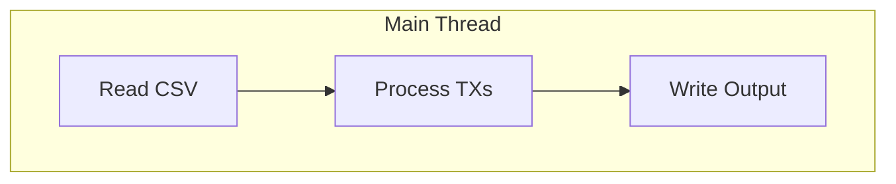
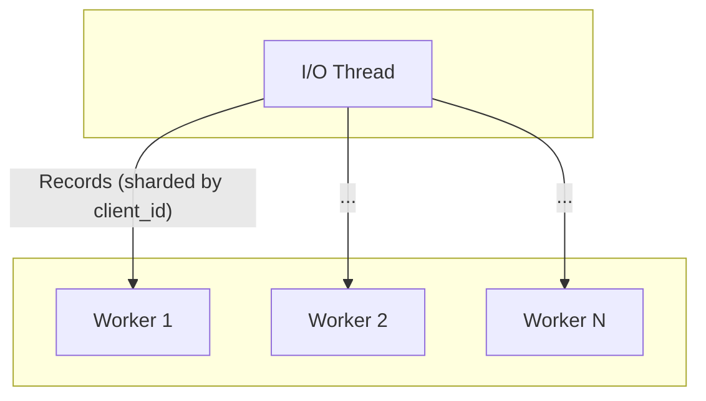
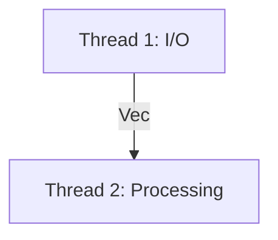
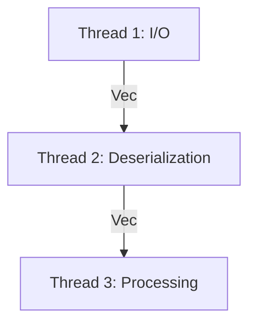

# rs-accountant

This project implements a payments engine in Rust that processes a stream of transactions from a CSV file, updates client account balances, and outputs the final state of all accounts to a CSV.

## Assumptions

In line with the prompt to make sensible assumptions for a financial system, the engine operates with the following rules:

### Explicitly Specified in Requirements
- **Single Asset Account**: Each client has a single asset account for all transactions
- **Client Creation**: If a client doesn't exist, create a new record automatically
- **Transaction Chronology**: Transactions are processed in chronological order as they appear in the file
- **Account Locking**: Accounts are locked when a chargeback occurs
- **Insufficient Funds**: Withdrawals fail if insufficient available funds exist

### Additional Business Logic Assumptions
- **Arbitrary Decimal Precision**: The engine supports arbitrary decimal precision for monetary values, with a minimum requirement to handle at least 2 decimal places for standard currency operations.

- **Locked Account Restrictions**: Once an account is locked due to a chargeback, no further transactions (deposits, withdrawals, or disputes) are processed for that account. This is a security measure to freeze activity on potentially fraudulent accounts.

- **No Overdraft Protection for Withdrawals**: Withdrawal transactions that would result in a negative available balance are rejected. The system does not support overdrafting or credit facilities for regular withdrawals.

- **Negative Balances Allowed for Disputes**: Disputes can create negative available balances if there are insufficient available funds. This represents debt owed due to disputes.

- **Invalid Transaction Handling**: Any deposit or withdrawal transaction with a negative amount is considered invalid and ignored.

- **Dispute Ownership**: A dispute is only considered valid if the client ID on the dispute record matches the client ID of the original transaction being disputed. This prevents one client from being able to dispute another client's transactions.

- **Missing Amount Handling**: Transactions that should have an amount but don't (deposits/withdrawals) are silently ignored.

- **Invalid Reference Handling**: Dispute, resolve, and chargeback transactions that reference non-existent transaction IDs are ignored.

- **Chargeback Finality**: After a chargeback occurs:
  - The disputed transaction is marked as `ChargedBack` and cannot be disputed again
  - The account is automatically locked to prevent further activity
  - No further disputes, resolves, or chargebacks can be processed on the locked account

## Features

- Processes five types of transactions: `deposit`, `withdrawal`, `dispute`, `resolve`, and `chargeback`.
- Handles client accounts, including available funds, held funds, and locked status.
- Support for arbitrary decimal precision.
- Reads from a CSV file and writes the resulting account states to standard output.
- Data generation tools for testing and benchmarking.

## How to Run

### Prerequisites

- [Rust](https://www.rust-lang.org/tools/install) toolchain
- `make`

### Build

A `Makefile` is provided for convenience. To build the application in release mode, run:
```sh
make build
```

### Run

To run the application, use the `make run` command and pass the input file path as a variable. The resulting accounts CSV will be written to standard output.

```sh
make run file=transactions.csv > accounts.csv
```

### Test

To run the suite of integration tests:

```sh
make test
```

### Lint

To run code quality checks with clippy:

```sh
make lint
```

### End-to-End Testing

To run an end-to-end test with randomly generated data:

```sh
make test-e2e
```

This will:
1. Generate random test data using the built-in `data-generator`
2. Run the engine on this data
3. Compare the output against expected results
4. Clean up temporary files

### Stress Testing

For performance testing with large datasets, the project includes stress testing capabilities:

#### Generate Large Test Data

To generate a ~1GB test file with approximately 35 million transactions:

```sh
make generate-stress-input
```

This creates a file called `large_input.csv` in the current directory.

#### Run Stress Test

To benchmark the engine against the large dataset:

```sh
make stress-test
```

This will run the engine on `large_input.csv` and measure execution time using the `time` utility. The output is discarded to focus purely on performance measurement.

**Note**: The stress test requires ~1GB disk space. On modern systems, expect completion in under 30 seconds.

## Architectural Evolution & Performance

The engine was optimized for a large (1GB, 35M transactions) dataset. Several architectures were tested to find the right balance of parallelism and overhead.

### 1. Single-Threaded (Fastest)

- **Design**: The simplest approach. All work (I/O, deserialization, and processing) happens sequentially on the main thread.
- **Outcome**: Surprisingly, this was the most performant model. The overhead of creating threads and managing communication channels outweighed the benefits of parallel execution for this specific, CPU-bound workload.

<div align="center">


</div>

### 2. Multi-Worker Sharding

- **Design**: An initial attempt at parallelism involved a single I/O thread dispatching raw CSV records to a pool of worker threads based on `client_id`. Each worker processed all transactions for its assigned clients.
- **Outcome**: This model proved to be inefficient. The overhead of routing records and managing many threads was too high.

<div align="center">


</div>

### 3. Two-Stage Pipeline

- **Design**: The architecture was simplified to a two-thread pipeline. A dedicated I/O thread reads and parses the file, sending batches of raw records to a single, dedicated processing thread.
- **Outcome**: This was a significant improvement. By creating a clean separation between I/O and processing, allowing both tasks to run concurrently.

<div align="center">


</div>

### 4. Three-Stage Pipeline

- **Design**: To further refine the pipeline, the processing work was split into two stages, creating a three-thread pipeline for I/O, Deserialization, and Processing.
- **Outcome**: This design also proved to be highly efficient and was the fastest of the multi-threaded approaches.

<div align="center">


</div>

### Benchmark Summary

The final, surprising result of the performance tuning was that a simple, single-threaded architecture was the most performant for this specific workload. The overhead of creating threads and managing communication between them ultimately outweighed the benefits of parallel execution.

Below are the benchmark results for each approach, as measured by the `time` utility on a large (1GB, 35M transactions) dataset.

| Architecture             | Real Time (Wall Clock) | User Time (Total CPU) |
| ------------------------ | ---------------------- | --------------------- |
| **Single-Threaded**      | **`~26-27s`**          | **`~25-26s`**         |
| Three-Stage Pipeline     | `~30.2s`               | `~1m 2s`              |
| Two-Stage Pipeline       | `~33.3s`               | `~1m 2s`              |
| Multi-Worker Sharding    | `~40.9s`               | `~1m 46s`             |

## TODO

### Testing & Quality Assurance
- [ ] **Determine test coverage** - Add tooling to measure and report code coverage metrics
- [ ] **Expand test suite** - Add more edge cases and comprehensive scenario testing
- [ ] **Property-based testing** - Implement property-based tests using `proptest` or `quickcheck`
- [ ] **Benchmark suite** - Add formal benchmarking with `criterion` for performance regression detection

### Features & Enhancements
- [ ] **Enable user-defined dataset size for stress testing** - Allow configurable transaction count and file size for stress tests
- [ ] **Overdraft protection** - Add configurable overdraft limits and credit facilities for accounts
- [ ] **Transaction validation** - Add more robust input validation and error reporting
- [ ] **Configurable precision** - Allow users to specify decimal precision for monetary values
- [ ] **Multiple output formats** - Support JSON, XML, or other output formats beyond CSV
- [ ] **Logging and observability** - Add structured logging for debugging and monitoring

### Performance & Scalability
- [ ] **Memory usage profiling** - Analyze and optimize memory consumption patterns
- [ ] **Streaming output** - Implement streaming CSV output for very large result sets
- [ ] **Database backend** - Add optional database storage for persistent state
- [ ] **Compression support** - Support reading compressed input files (gzip, etc.)

### Developer Experience
- [ ] **CI/CD pipeline** - Set up automated testing and release workflows
- [ ] **Docker support** - Add Dockerfile, Compose, and container deployment options
- [ ] **Performance monitoring** - Add built-in performance metrics and reporting

### Contributing
- [ ] **Contributing guidelines** - Add CONTRIBUTING.md with development setup and code standards
- [ ] **Code linting** - Ensure all code passes `cargo clippy` without warnings before submitting PRs
- [ ] **Pre-commit hooks** - Set up automated formatting and linting checks
- [ ] **Issue templates** - Create GitHub issue templates for bugs and feature requests