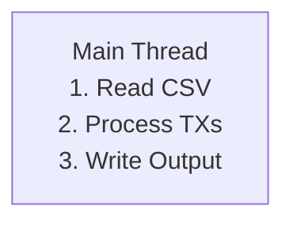
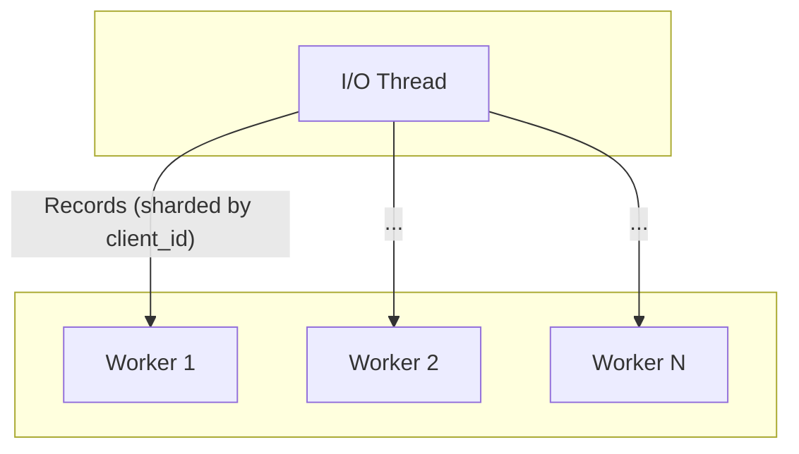
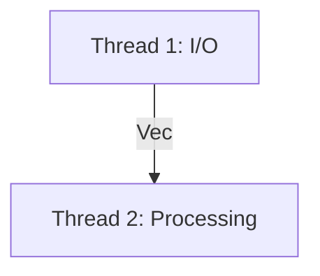
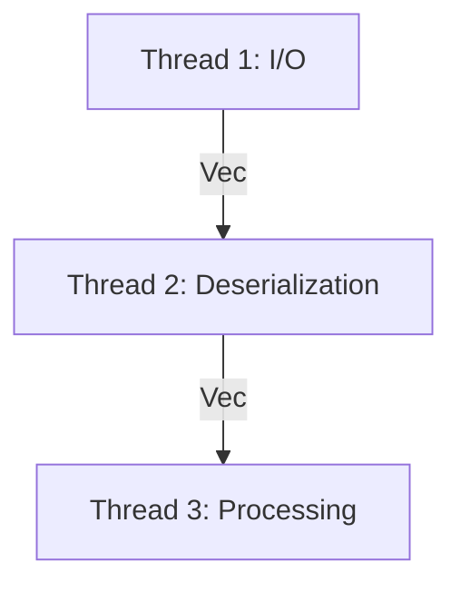

# Toy Payments Engine

This project implements a toy payments engine in Rust that processes a stream of transactions from a CSV file, updates client account balances, and outputs the final state of all accounts to a CSV.

## Assumptions

In line with the prompt to make sensible assumptions for a financial system, the engine operates with the following rules:

- **Locked Accounts**: Once an account is locked due to a chargeback, no further transactions (deposits, withdrawals, or disputes) are processed for that account. This is a security measure to freeze activity on potentially fraudulent accounts.
- **Negative Amounts**: Any deposit or withdrawal transaction with a negative amount is considered invalid and ignored.
- **Dispute Ownership**: A dispute is only considered valid if the client ID on the dispute record matches the client ID of the original transaction being disputed. This prevents one client from being able to dispute another client's transactions.

## Features

- Processes five types of transactions: `deposit`, `withdrawal`, `dispute`, `resolve`, and `chargeback`.
- Handles client accounts, including available funds, held funds, and locked status.
- Reads from a CSV file and writes the resulting account states to standard output.
- Built to be efficient and robust, capable of handling large datasets.

## How to Run

### Prerequisites

- [Rust](https://www.rust-lang.org/tools/install) toolchain
- `make`

### Build

A `Makefile` is provided for convenience. To build the application in release mode, run:
```sh
make build
```
This is a shortcut for `cargo build --release`.

### Run

To run the application, use the `make run` command and pass the input file path as a variable. The resulting accounts CSV will be written to standard output.

```sh
make run file=transactions.csv > accounts.csv
```

This is a shortcut for `cargo run --release -- transactions.csv`.

### Test

To run the suite of integration tests:

```sh
make test
```
This is a shortcut for `cargo test`.

## Architectural Evolution & Performance

The engine was optimized for a large (1GB, 35M transactions) dataset. Several architectures were tested to find the right balance of parallelism and overhead.

### 1. Single-Threaded (Winner)

- **Design**: The simplest approach. All work (I/O, deserialization, and processing) happens sequentially on the main thread.
- **Outcome**: Surprisingly, this was the most performant model. The overhead of creating threads and managing communication channels outweighed the benefits of parallel execution for this specific, CPU-bound workload.



### 2. Multi-Worker Sharding

- **Design**: An initial attempt at parallelism involved a single I/O thread dispatching raw CSV records to a pool of worker threads based on `client_id`. Each worker processed all transactions for its assigned clients.
- **Outcome**: This model proved to be inefficient. The overhead of routing records and managing many threads was too high.



### 3. Two-Stage Pipeline

- **Design**: The architecture was simplified to a two-thread pipeline. A dedicated I/O thread reads and parses the file, sending batches of raw records to a single, dedicated processing thread.
- **Outcome**: This was a significant improvement. By creating a clean separation between I/O and processing, we allowed both tasks to run concurrently.



### 4. Three-Stage Pipeline

- **Design**: To further refine the pipeline, the processing work was split into two stages, creating a three-thread pipeline for I/O, Deserialization, and Processing.
- **Outcome**: This design also proved to be highly efficient and was the fastest of the multi-threaded approaches.



### Benchmark Summary

The final, surprising result of the performance tuning was that a simple, single-threaded architecture was the most performant for this specific workload. The overhead of creating threads and managing communication between them ultimately outweighed the benefits of parallel execution.

Below are the benchmark results for each approach, as measured by the `time` utility on a large (1GB, 35M transactions) dataset.

| Architecture             | Real Time (Wall Clock) | User Time (Total CPU) |
| ------------------------ | ---------------------- | --------------------- |
| **Single-Threaded**      | **`~28.8s`**           | **`~27.6s`**          |
| Three-Stage Pipeline     | `~30.2s`               | `~1m 2s`              |
| Two-Stage Pipeline       | `~33.3s`               | `~1m 2s`              |
| Multi-Worker Sharding    | `~40.9s`               | `~1m 46s`             |

## Detailed Design & Implementation

### Core Logic

- **Streaming for Scalability**: The engine processes the input CSV as a stream using the `csv` crate's deserialization capabilities. This approach is highly memory-efficient, as it does not require loading the entire transaction file into memory. This ensures the application can scale to handle very large data sets without consuming excessive system resources.

- **Precise Financial Calculations**: Floating-point arithmetic can introduce precision errors, which are unacceptable in financial applications. To ensure correctness, this engine uses the `rust_decimal` crate for all monetary calculations. It provides a `Decimal` type that handles fixed-precision arithmetic accurately.

- **Efficient Data Structures**:
  - **Accounts**: A `HashMap<ClientId, Account>` is used to store client accounts. This provides average O(1) time complexity for lookups, insertions, and updates, which is ideal for quickly accessing account data.
  - **Transactions**: A `HashMap<TransactionId, StoredTransaction>` stores deposit and withdrawal transactions that may be disputed later. This allows for efficient lookups when a `dispute`, `resolve`, or `chargeback` transaction refers to an earlier one by its ID.

### Code Organization

The project is structured as a Rust library and a binary.
- The core logic (the `PaymentEngine`, data structures, and processing functions) resides in the library (`src/lib.rs` and `src/engine.rs`).
- The executable (`src/main.rs`) is a thin wrapper responsible for parsing command-line arguments and coordinating the engine's execution.

This separation of concerns makes the code more modular, easier to test, and reusable.

### Testing Strategy

The correctness of the transaction processing logic is validated through a suite of integration tests located in the `tests` directory. These tests cover all critical scenarios, including:
- Simple deposits and withdrawals.
- Withdrawals with insufficient funds.
- The full dispute/resolve/chargeback lifecycle.
- Transactions on locked accounts.

This test-driven approach helps guarantee that the engine behaves as expected under various conditions.