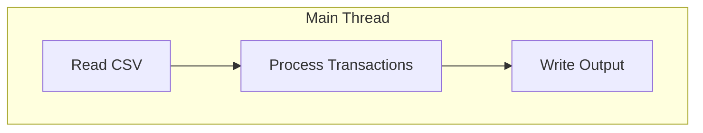
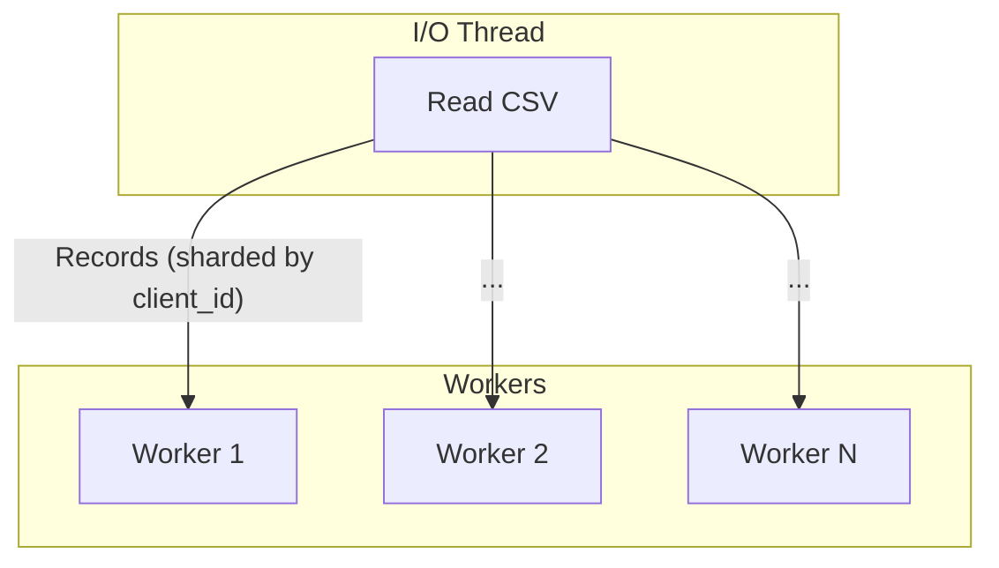
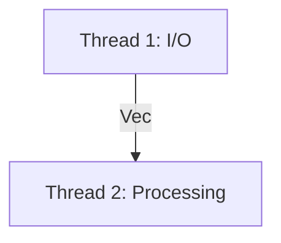
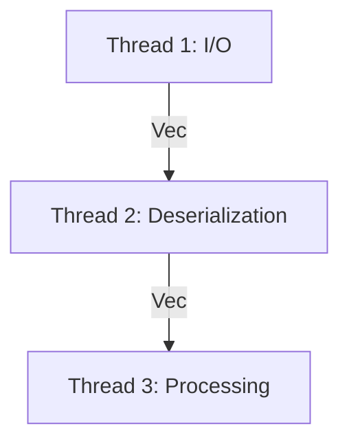

# rs-accountant

This project implements a payments engine in Rust that processes transactions from a CSV file, updates client account balances, and outputs the final state of all accounts.

## Quick Start

```sh
make build
make run file=transactions.csv > accounts.csv
```

## Table of Contents
- [Quick Start](#quick-start)
- [Assumptions](#assumptions)
- [Features](#features)
- [Example Usage](#example-usage)
- [How to Run](#how-to-run)
- [Architectural Evolution & Performance](#architectural-evolution--performance)
- [Benchmarks](#benchmarks)
- [TODO](#todo)

## Assumptions

### Explicitly Specified in Requirements
- Single asset account per client
- Automatic client creation
- Chronological transaction processing
- Account locking on chargebacks
- Withdrawals fail on insufficient funds

### Additional Business Logic Assumptions
- Arbitrary decimal precision
- Locked accounts restrict further transactions
- No overdraft protection for withdrawals
- Negative balances allowed for disputes
- Invalid transactions ignored
- Dispute ownership validation
- Missing amounts ignored
- Invalid references ignored
- Chargeback finality:
  - Disputed transaction marked as `ChargedBack`
  - Account immediately locked, preventing further transactions

## Features
- Transaction types: `deposit`, `withdrawal`, `dispute`, `resolve`, `chargeback`
- Client account management
- Arbitrary decimal precision
- CSV input
- Data generation tools for testing

## Example Usage

### Input CSV Example
```csv
type,client,tx,amount
deposit,1,1,1000.00
withdrawal,1,2,500.00
dispute,1,1
resolve,1,1
chargeback,1,1
```

### Output CSV Example
```csv
client,available,held,total,locked
1,500.00,0.00,500.00,true
```

## How to Run

### Prerequisites

- [Rust](https://www.rust-lang.org/tools/install) toolchain
- `make`

### Build

A `Makefile` is provided for convenience. To build the application in release mode, run:
```sh
make build
```

### Run

To run the application, use the `make run` command and pass the input file path as a variable. The resulting accounts CSV will be written to standard output.

```sh
make run file=transactions.csv > accounts.csv
```

### Test

To run the suite of integration tests:

```sh
make test
```

### Lint

To run code quality checks with clippy:

```sh
make lint
```

### End-to-End Testing

To run an end-to-end test with randomly generated data:

```sh
make test-e2e
```

This will:
1. Generate random test data using the built-in `data-generator`
2. Run the engine on this data
3. Compare the output against expected results
4. Clean up temporary files

### Stress Testing

For performance testing with large datasets, the project includes stress testing capabilities:

#### Generate Large Test Data

To generate a ~1GB test file with approximately 35 million transactions:

```sh
make generate-stress-input
```

This creates a file called `large_input.csv` in the current directory.

#### Run Stress Test

To benchmark the engine against the large dataset:

```sh
make stress-test
```

This will run the engine on `large_input.csv` and measure execution time using the `time` utility. The output is discarded to focus purely on performance measurement.

**Note**: The stress test requires ~1GB disk space. On modern systems, expect completion in under 30 seconds.

## Architectural Evolution & Performance

The engine was optimized for large datasets (~1GB, 35M transactions). Several architectures were tested to balance parallelism and overhead:

### 1. Single-Threaded (Fastest)

Simplest approach with sequential processing:

<div align="center">



</div>

### 2. Multi-Worker Sharding

Parallel processing with multiple workers based on `client_id`:

<div align="center">



</div>

### 3. Two-Stage Pipeline

Dedicated threads for I/O and processing:

<div align="center">



</div>

### 4. Three-Stage Pipeline

Further refined pipeline with separate deserialization stage:

<div align="center">



</div>

### Benchmarks

| Architecture             | Real Time (Wall Clock) | User Time (Total CPU) |
| ------------------------ | ---------------------- | --------------------- |
| **Single-Threaded**      | **`~26-27s`**          | **`~25-26s`**         |
| Three-Stage Pipeline     | `~30.2s`               | `~1m 2s`              |
| Two-Stage Pipeline       | `~33.3s`               | `~1m 2s`              |
| Multi-Worker Sharding    | `~40.9s`               | `~1m 46s`             |

## TODO

### Testing & Quality Assurance
- [ ] **Determine test coverage** - Add tooling to measure and report code coverage metrics
- [ ] **Expand test suite** - Add more edge cases and comprehensive scenario testing
- [ ] **Property-based testing** - Implement property-based tests using `proptest` or `quickcheck`
- [ ] **Benchmark suite** - Add formal benchmarking with `criterion` for performance regression detection

### Features & Enhancements
- [ ] **Enable user-defined dataset size for stress testing** - Allow configurable transaction count and file size for stress tests
- [ ] **Overdraft protection** - Add configurable overdraft limits and credit facilities for accounts
- [ ] **Transaction validation** - Add more robust input validation and error reporting
- [ ] **Configurable precision** - Allow users to specify decimal precision for monetary values
- [ ] **Multiple output formats** - Support JSON, XML, or other output formats beyond CSV
- [ ] **Logging and observability** - Add structured logging for debugging and monitoring

### Performance & Scalability
- [ ] **Memory usage profiling** - Analyze and optimize memory consumption patterns
- [ ] **Streaming output** - Implement streaming CSV output for very large result sets
- [ ] **Database backend** - Add optional database storage for persistent state
- [ ] **Compression support** - Support reading compressed input files (gzip, etc.)

### Developer Experience
- [ ] **CI/CD pipeline** - Set up automated testing and release workflows
- [ ] **Docker support** - Add Dockerfile, Compose, and container deployment options
- [ ] **Performance monitoring** - Add built-in performance metrics and reporting

### Contributing
- [ ] **Contributing guidelines** - Add CONTRIBUTING.md with development setup and code standards
- [ ] **Code linting** - Ensure all code passes `cargo clippy` without warnings before submitting PRs
- [ ] **Pre-commit hooks** - Set up automated formatting and linting checks
- [ ] **Issue templates** - Create GitHub issue templates for bugs and feature requests

## Contributing
Contributions are welcome! Please open an issue or submit a pull request.

## License
This project is licensed under the MIT License. See [LICENSE](LICENSE) for details.
